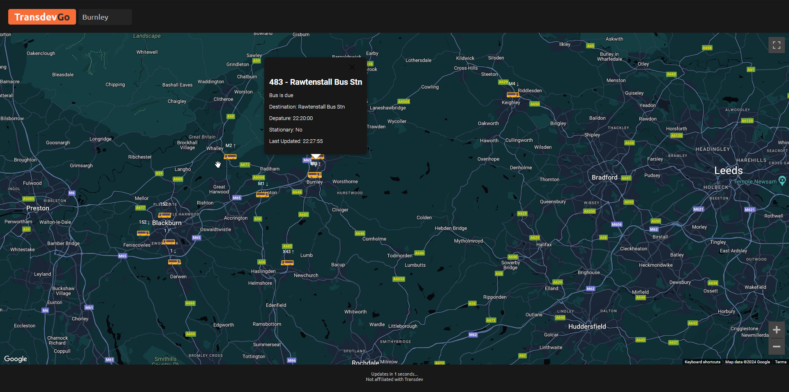

# TransdevGo
A web-based, real-time bus viewer for Transdev Services

## Features
- Real-time, updates every 15 seconds
- Lightweight, works with any device
- User-Friendly, straight to the point
- Anonymous, does not require login
- Supports all regions

## Upcoming Features
- Drawing individual bus routes
- Service warnings

  
Site Preview

  

[Try it out](https://transdev.live)